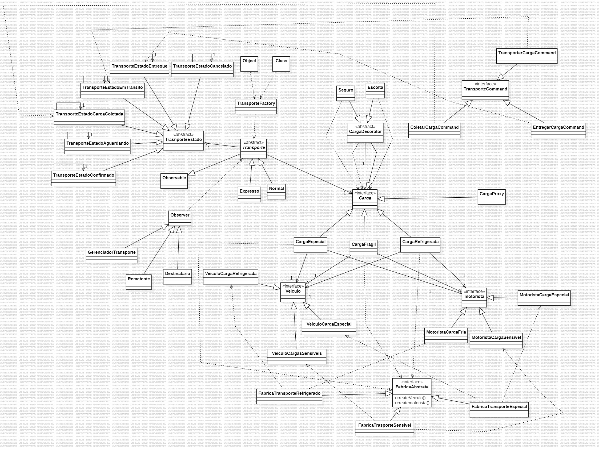
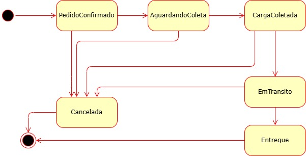

# Trabalho Prático - Aspectos Avançados em Engenharia de Software

## Design Patterns

### Descrição
O sistema de gerenciamento de transportadora.

### Padrões Usados no Sistema

| **Padrão**        | **Aplicação** |
|-------------------|------------------------------------------------------------------------------------------------|
| **Factory Method** | Criar tipos de transporte (Expresso/Normal). |
| **Template Method** | Calcular taxa de frete com passos comuns e específicos. |
| **Bridge**        | Separar carga (CargaEspecial, CargaFragil, CargaRefrigerada) de sua implementação. |
| **Singleton**     | Garantir única instância dos estados da entrega. |
| **Decorator**     | Adicionar serviços (Seguro, Escolta) a uma carga. |
| **State**         | Gerenciar estados de uma entrega. |
| **Observer**      | Notificar remetente/destinatário/gerenciador sobre mudanças de status. |
| **Abstract Factory** | Criar famílias de veículos e motoristas especializados. |
| **Strategy**      | Definir diferentes estratégias de roteamento para otimização de entrega. |
| **Command**       | Gerenciar operações reversíveis (ex: agendar entrega, cancelar entrega). |

### Diagramas

